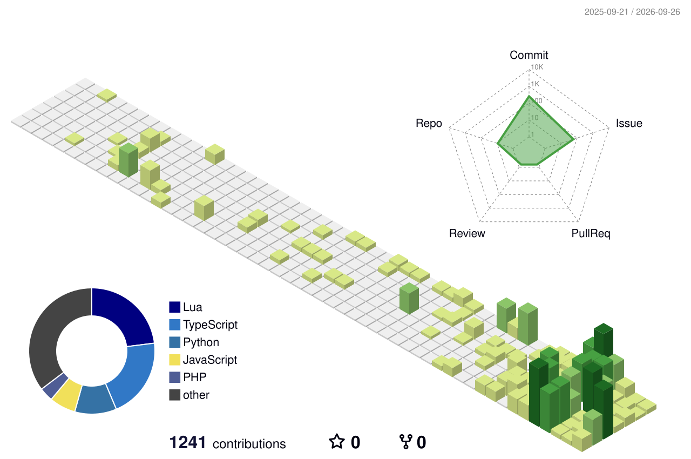

<div align="center">

[](mailto:sahiltuchhe123@gmail.com)
[](https://sahiltuchheshrestha.com.np)
[](https://github.com/sahilstha0007/sahilstha0007/issues/1)

<a href="https://git.io/typing-svg"></a>


</div>

---

## ~/whoami

```console
sahil@github:~$ ls ./identity/
bit-student-kathmandu    full-stack-developer    linux-power-user
aws-deployer             llm-tinkerer            ex-distro-hopper*

sahil@github:~$ cat mission.txt
Build web apps end-to-end. Break nothing. Rice everything.

*tried Fedora. EndeavourOS. Parrot. Came back to Arch. They always come back.
```

- 🔭 Full-stack: **Next.js / TypeScript** front · **Laravel / Node.js** back
- ☁️ Deployed my own AWS stack — VPC → ALB → Auto Scaling → RDS
- 🧬 HP BIOS refused `amd_pstate` → **I patched the kernel source instead**
- 🤖 Runs local LLM pipelines & model routers for free-tier AI coding

<div align="center">
<a href="https://skillicons.dev"></a>
</div>

---

## ~/projects

| Project | What it is | Stack |
|---|---|---|
| **[Portfolio](https://sahiltuchheshrestha.com.np)** 🌐 | My corner of the internet | Next.js |
| **[Lumin](https://github.com/sahilstha0007/lumin)** | Shop app running on my own AWS infra | Laravel · Next.js |
| **[Finest](https://github.com/sahilstha0007/Finest)** | Digital marketplace for artists | JavaScript |
| **[CustomNeovim](https://github.com/sahilstha0007/CustomNeovim)** | My hand-tuned editor distro | Lua |
| **dotfiles** *(private)* | The entire rice, git-backed | shell · lua |

---

## 💬 Guestbook *(live — a bot writes visitors into this page)*

<!-- GUESTBOOK:START -->
_No signatures yet — [be the first!](https://github.com/sahilstha0007/sahilstha0007/issues/1)_
<!-- GUESTBOOK:END -->

### 🧠 Transmission of the day
<!-- QUOTE:START -->
> [!NOTE]
> It works on my machine.
> — *Every developer, eventually*
<!-- QUOTE:END -->

<details>
<summary><b>🖥️ ssh guest@sahil — open a terminal on me</b></summary>

```console
$ neofetch
OS        : Arch Linux x86_64 (btw)
WM        : Hyprland (matugen-themed, wallpaper-reactive)
Terminal  : kitty · 20000-line scrollback
Editor    : CustomNeovim — see pinned repo
Shell     : zsh + atuin + mise + fzf
Kernel    : 7.1.2-zen-devmode-dirty   ← self-patched. HP BIOS lost.
Uptime    : longer than my sleep schedule

$ sudo systemctl status motivation
● active (running) — since 2024

$ pacman -S new-idea --noconfirm
resolving dependencies... done.
```

</details>

<details>
<summary><b>🔓 Click to unlock the rice secrets</b></summary>

- 🔥 CPU power limits forced to 60W / 90°C via `ryzenadj` ("the jailbreak")
- 🎨 Every app re-colors itself via **matugen** when I change wallpaper
- ⌨️ `ctrl+r` = full-screen synced history (atuin), `ctrl+t` = fd-powered fuzzy find
- 📸 `Super+Alt+A` → screenshot → annotate with satty → clipboard
- 💾 Dotfiles survive anything: bare git repo → auto-pushed to private GitHub
- ✍️ Every commit SSH-signed — look for the **Verified** badge below

</details>

---

## 📊 Telemetry

<div align="center">


</div>

### 🧊 3D Contribution Cube
<p align="center">

</p>

### 🐍 Snake
<picture>
  <source media="(prefers-color-scheme: dark)" srcset="https://raw.githubusercontent.com/sahilstha0007/sahilstha0007/output/github-snake-dark.svg" />
  <source media="(prefers-color-scheme: light)" srcset="https://raw.githubusercontent.com/sahilstha0007/sahilstha0007/output/github-snake.svg" />
  
</picture>

<div align="center">

<i>`$ echo "thanks for scrolling" >> ~/.visitors`</i>

</div>


