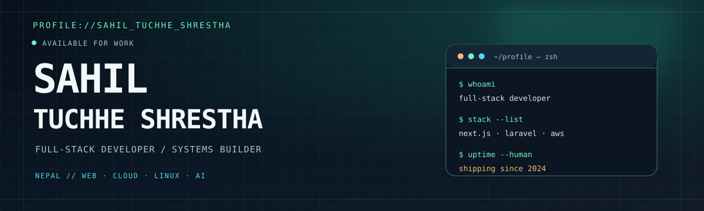

<div align="center">

<a href="https://sahiltuchheshrestha.com.np">
  <picture>
    <source media="(max-width: 600px)" srcset="./profile-hero-mobile.svg" />
    
  </picture>
</a>

# Hey, I'm Sahil.

I build dependable web products from the database to the browser, with a soft spot for Linux, cloud infrastructure, and practical AI tooling.

[](mailto:sahiltuchhe123@gmail.com)
[](https://sahiltuchheshrestha.com.np)
[](https://github.com/sahilstha0007/sahilstha0007/issues/1)

[](https://github.com/sahilstha0007)

[View my portfolio](https://sahiltuchheshrestha.com.np) · [Email me](mailto:sahiltuchhe123@gmail.com) · [Sign the guestbook](https://github.com/sahilstha0007/sahilstha0007/issues/1)

</div>

---

## Signal

<table>
  <tr>
    <td align="center" width="50%">
      <strong>WEB PRODUCTS</strong><br />
      <code>Next.js · TypeScript · Laravel · Node.js</code>
    </td>
    <td align="center" width="50%">
      <strong>CLOUD SYSTEMS</strong><br />
      <code>AWS · VPC · ALB · RDS</code>
    </td>
  </tr>
  <tr>
    <td align="center">
      <strong>LOCAL TOOLING</strong><br />
      <code>Arch · Hyprland · Neovim</code>
    </td>
    <td align="center">
      <strong>APPLIED AI</strong><br />
      <code>LLM pipelines · model routing</code>
    </td>
  </tr>
</table>

I care about the whole path: interface → API → infrastructure → feedback.

## Selected work

| Project | What it does | Stack |
|---|---|---|
| **[Portfolio](https://sahiltuchheshrestha.com.np)** | Personal site and a home for my experiments. | Next.js · TypeScript |
| **[Lumin](https://github.com/sahilstha0007/lumin)** | Shop application deployed on my own AWS stack. | Laravel · Next.js |
| **[Finest](https://github.com/sahilstha0007/Finest)** | Digital marketplace for artists. | JavaScript |
| **[mydotfiles](https://github.com/sahilstha0007/mydotfiles)** | LazyVim-based editor setup with LSP, DAP, and custom themes. | Lua |
| **[Agentic Career Advisor](https://github.com/sahilstha0007/aggentic-carrer-advisor)** | RAG career coach with tool-using agent workflows. | Python · LangGraph · Gemini |

## ~/whoami

```console
sahil@github:~$ ls ./identity/
bit-student-kathmandu    full-stack-developer
aws-deployer             linux-power-user
llm-tinkerer             ex-distro-hopper*

sahil@github:~$ cat mission.txt
Build useful software, understand the stack, and make the terminal feel like home.

*tried Fedora, EndeavourOS, and Parrot. Came back to Arch.*
```

<div align="center">
  <a href="https://skillicons.dev" aria-label="View the technologies I use">
    
  </a>
</div>

---

## Guestbook

Leave a first-line message on [issue #1](https://github.com/sahilstha0007/sahilstha0007/issues/1). The profile workflow renders the latest signatures here.

<!-- GUESTBOOK:START -->
_No signatures yet — [be the first!](https://github.com/sahilstha0007/sahilstha0007/issues/1)_
<!-- GUESTBOOK:END -->

## Daily transmission

<!-- QUOTE:START -->
> [!NOTE]
> There are two hard things in CS: cache invalidation, naming things, and off-by-one errors.
> — *Anonymous*
<!-- QUOTE:END -->

<details>
<summary><b>Open the terminal</b></summary>

```console
$ neofetch
OS        : Arch Linux x86_64
WM        : Hyprland (matugen-themed)
Terminal  : kitty
Editor    : Neovim
Shell     : zsh + atuin + mise + fzf
Uptime    : longer than my sleep schedule

$ sudo systemctl status motivation
● active (running) — since 2024

$ pacman -S new-idea --noconfirm
resolving dependencies... done.
```

</details>

<details>
<summary><b>Local setup notes</b></summary>

- CPU power limits are tuned with `ryzenadj`.
- `matugen` recolors applications when the wallpaper changes.
- `atuin` and `fzf` handle history and fuzzy finding.
- `satty` handles screenshot annotation.
- Dotfiles are backed up from a private repository.

</details>

---

## `./activity`

`● LIVE` **Recent commits + GitHub activity**

<!-- RECENT_ACTIVITY:START -->
- **[sahilstha0007/mydotfiles](https://github.com/sahilstha0007/mydotfiles)** — [theme: brighter text on darker backing — readability pass](https://github.com/sahilstha0007/mydotfiles/commit/ca769f04760aa26c5ad7eb587931975a71383e34)
- **[sahilstha0007/mydotfiles](https://github.com/sahilstha0007/mydotfiles)** — [theme\(wezterm\): revert to the ca769f0 readability setup](https://github.com/sahilstha0007/mydotfiles/commit/595e5e9b3b443e7e176303701b7a5fecf484fe95)
- **[sahilstha0007/mydotfiles](https://github.com/sahilstha0007/mydotfiles)** — [theme\(nvim\): functional color variation for every code role](https://github.com/sahilstha0007/mydotfiles/commit/ba3d8dacc76bae42ca7f6fb947776f7738597d02)
- **[sahilstha0007/mydotfiles](https://github.com/sahilstha0007/mydotfiles)** — [theme\(wezterm\): center-weighted scrim for busy wallpapers](https://github.com/sahilstha0007/mydotfiles/commit/9eb0a2f32c4b713e03431f46f72db73f2557dde8)
- **[sahilstha0007/mydotfiles](https://github.com/sahilstha0007/mydotfiles)** — [theme\(nvim\): soften accent saturation s85 -&gt; s55](https://github.com/sahilstha0007/mydotfiles/commit/b2085aefe225c63cc963e7a85a43b1c2cc26371e)
<!-- RECENT_ACTIVITY:END -->

### 3D contribution cube

<p align="center">
  
</p>

### Contribution snake

<div align="center">

<picture>
  <source media="(prefers-color-scheme: dark)" srcset="https://raw.githubusercontent.com/sahilstha0007/sahilstha0007/output/github-snake-dark.svg" />
  <source media="(prefers-color-scheme: light)" srcset="https://raw.githubusercontent.com/sahilstha0007/sahilstha0007/output/github-snake.svg" />
  
</picture>

</div>

---

<p align="center"><i>Built with curiosity, coffee, and too many terminals.</i></p>
